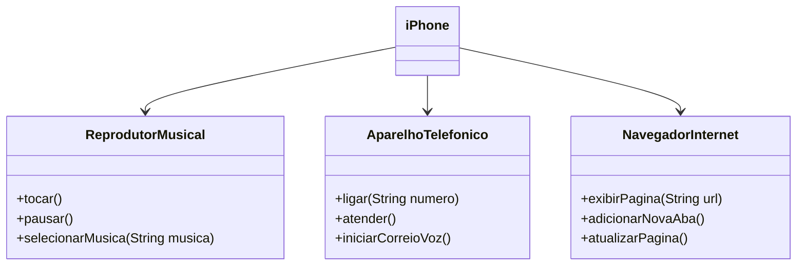

# Modelagem

## Diagrama de classes

Diagrama de classes proposto no exercício:

```mermaid
classDiagram

class ReprodutorMusical {
    +tocar()
    +pausar()
    +selecionarMusica(String musica)
}

class AparelhoTelefonico {
    +ligar(String numero)
    +atender()
    +iniciarCorreioVoz()
}

class NavegadorInternet {
    +exibirPagina(String url)
    +adicionarNovaAba()
    +atualizarPagina()
}

class iPhone {
    
}

iPhone --> ReprodutorMusical
iPhone --> AparelhoTelefonico
iPhone --> NavegadorInternet
```
